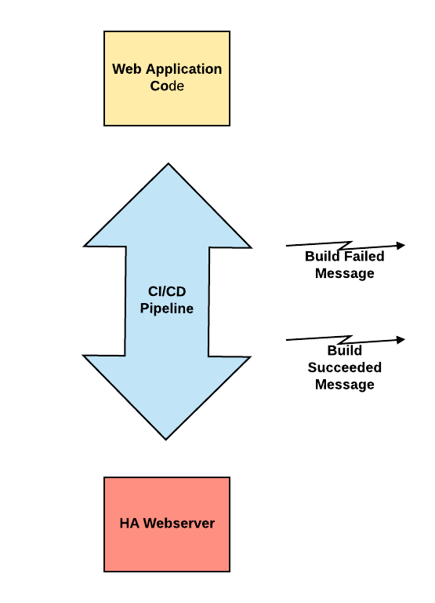
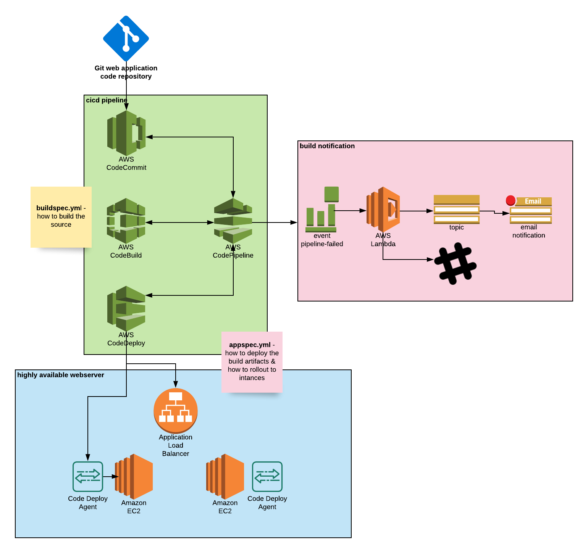

# aws-cloud-automation-meetup-cicd

## use case

A highly available front-end web application & API with CI/CD build system capable of continuous delivery and Slack/Email build notifications. 

## high level architecture

* web application code repo: https://github.com/michel-lacle/aws-cloud-automation-meetup-cicd-application-code
* cicd pipeline
* webserver
* vpc
* notification

## code pipeline architecture

